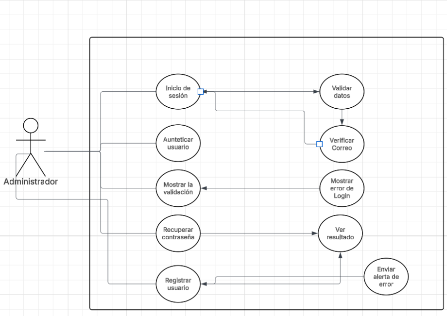
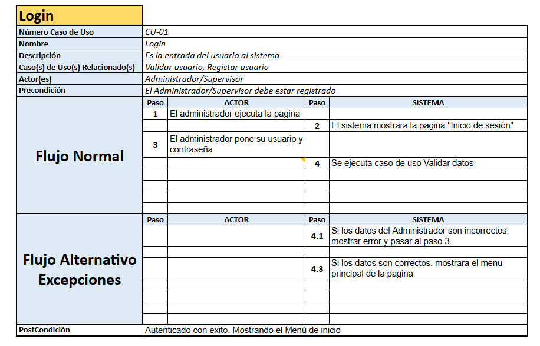
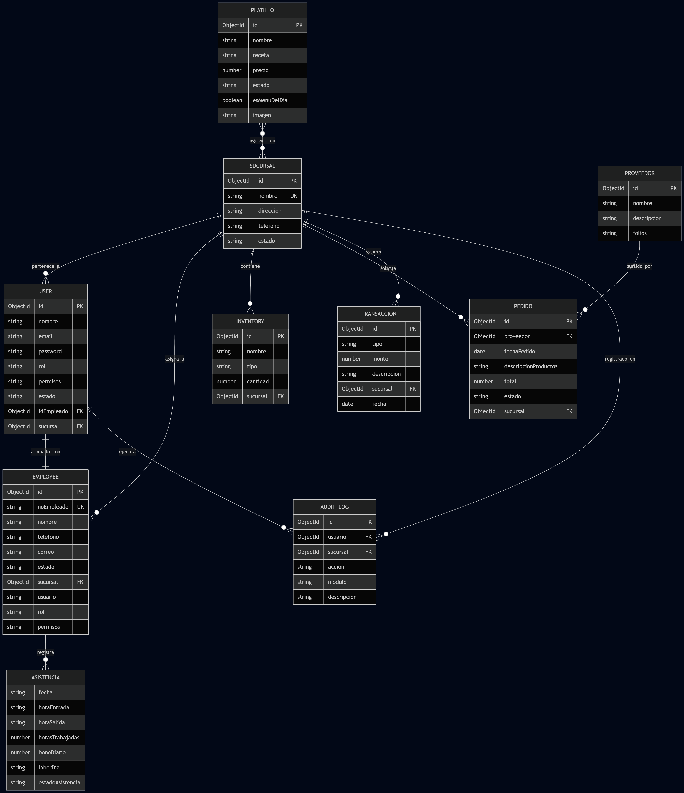
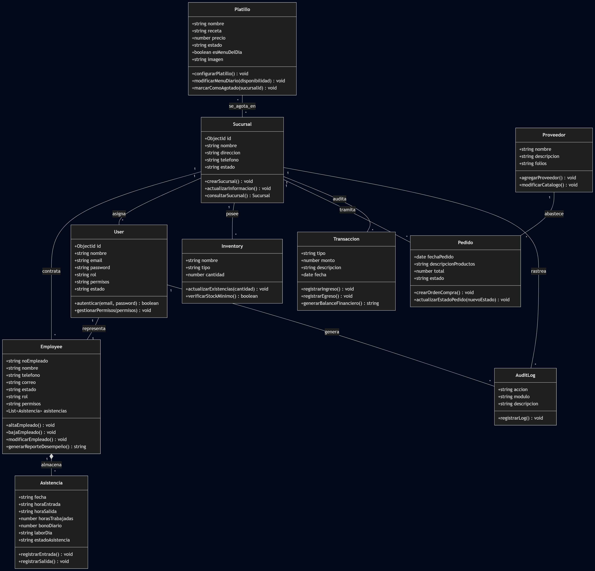
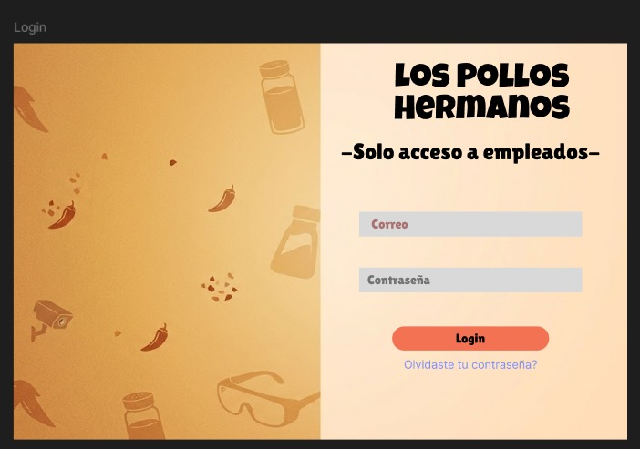
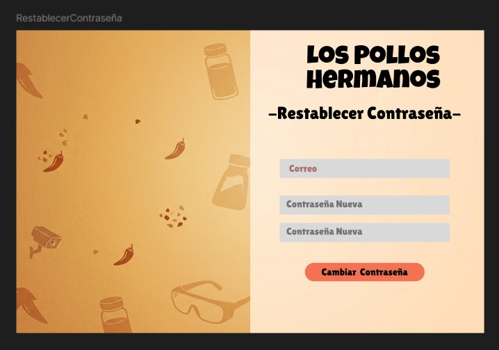

# **Integrantes del Equipo**
* Beltran Trizón Diego Alejandro
* Benitez Trejo Andres
* Carrillo Portillo Gael Efren
* Ponce Manjarrez Rommel
* Pérez Saavedra José Emiliano

# 1. INTRODUCCION
**Descripción General:** Los Pollos Hermanos son una cadena de restaurante altamente reconocido a nivel mundial por su exquisites y buen servicio. Asi que una pagina que ayude a administrar las sucursales ayudando el monitoreo y el manejo de inventario pueda ayudar a  agilizar la producción con la mejor calidad.

**Audiencia:** Administradores, jefes de surcusales (empleados de la empresa) con equipos de seguridad.

**Cobertura o alcance:** El sistema cubre desde el registro e inicio de sesión de usuarios hasta la administración de pedidos, productos, modificaciones de inventario y menú, incluyendo integración con redes sociales y seguimiento de envíos. Soporta operaciones tanto en escritorio como en dispositivos móviles.

# 2 RESUMEN DEL SISTEMA

**Objetivo general:** Desarrollar una pagina web que ayude a los administradores a actualizar y viligar sus productos con un mayor cuidado y antención.

## Características o funcionalidades principales
* Registro/Login de usuarios
* Registro de provedores de Ingredientes
* Menú del inventario.
* Información del empleado
* Perfil de usuario
* Ubicación de los locales
* Personal de limpieza

**Arquitectura del diseño**
* **Capa de presentación:** HTML,CSS,Bootstrap,javascript
* **Capa de aplicación:** Nodejs + Express
* **Capa de datos:** Mongodb

# 3. REQUISITOS
  **Funcionales:**
Los principales requisitos funcionales de la plataforma de comercio electrónico Los Pollos Hermanos son:
* **Autenticación e Inicio de sesión:** Permite a los usuarios acceder al sistema de forma segura mediante un formulario de credenciales y comprueba que los datos ingresados sean correctos.
* **Gestión de usuarios y permisos:** Permite al administrador dar de alta, baja, consultar y modificar usuarios, así como gestionar sus permisos de acceso según su número de empleado.
* **Gestión de empleados:** Permite al administrador administrar toda la información del personal (altas, bajas, consultas y modificaciones).
* **Control de personal:** Permite al administrador llevar el control y registro detallado de las asistencias, horarios y salarios de los empleados.
* **Reportes de desempeño:** Permite al administrador generar informes detallados sobre el rendimiento de los trabajadores.
* **Gestión de inventario:** Permite al personal controlar las existencias de productos e ingredientes (altas, bajas, consultas y actualizaciones).
* **Gestión de proveedores:** Permite al administrador controlar el catálogo de proveedores de productos e ingredientes.
* **Gestión de pedidos:** Permite al administrador realizar, consultar y actualizar las órdenes de compra dirigidas a los proveedores.
* **Gestión del menú general:** Permite a los empleados configurar, consultar y modificar los productos que forman parte del catálogo del menú.
* **Control financiero:** Permite al administrador llevar el registro y control exacto de los ingresos y egresos del negocio.
* **Informes y Estadísticas:** Permite al administrador generar reportes administrativos y operativos para evaluar el estado del negocio.
* **Menú del día:** Permite a los empleados modificar de forma rápida los platos disponibles en el menú diario.
* **Gestión de sucursales:** Permite al administrador dar de alta, baja, consultar y actualizar la información de las distintas sucursales.
* **Consulta de usuario:** Permite al cliente o usuario final visualizar de forma directa el menú, las sucursales, los productos y los ingredientes.

**No funcionales:**
* Rendimiento óptimo con tiempos de respuesta menores a 5 segundos por interacción
* Disponibilidad garantizada durante todo el horario laboral del negocio
* Seguridad, privacidad y protección estricta de los datos del personal
* Compatibilidad multiplataforma (diseño responsivo para escritorio y dispositivos móviles)
* Escalabilidad eficiente para soportar el incremento de usuarios en línea
* Interfaz de usuario sumamente sencilla, limpia e intuitiva
* Mecanismo de respaldos periódicos y automáticos de la base de datos
* Mantenimiento y actualizaciones fluidas sin afectar gravemente la operación diaria
* Tolerancia a fallos con visualización de mensajes de error claros y orientativos
* Rápida capacidad de recuperación ante caídas (restablecimiento en un máximo de 10 minutos)
* Sincronización y actualización de datos en tiempo real para ventas e inventario
* Alta capacidad de almacenamiento para gestionar grandes volúmenes de registros sin perder velocidad
* Acceso constante y sin restricciones a la información almacenada para consultas rápidas
* Presentación visual de la información de manera ordenada, clara y legible
* Estabilidad operativa continua y sin interrupciones durante el uso diario
* Proceso de instalación y configuración inicial ágil y sencillo en los equipos del negocio
* Alta usabilidad con una curva de aprendizaje menor a una hora de capacitación
* Consumo de recursos de hardware optimizado (uso eficiente de memoria y procesador)
* Arquitectura basada en estándares de diseño de software para facilitar mejoras futuras
* Mecanismos de seguridad avanzados en la base de datos para evitar accesos no autorizados

## **Tecnicos:**

* **Lenguaje:** Javascript (Frontend y backed)
* **Frameworks/Librerías:** Express.js, Bootstrap
* **Base de datos:** MongoDB 6.0
* **Herramientas:**  Figma (prototipado), GitHub (control de versiones), VS Code

## **Arquitectura del Sistema:**
Modularidad mediante rutas y controladores en Node.js

Componentes RESTful: usuarios, artículos, pedidos, pagos
Frontend estático y API desacoplada para interoperabilidad

# 4. Instalación

## Instalación y Ejecución Local

**Requisitos de software:**

- Node.js (v18 o superior)
- Express.js
- MongoDB local
- Navegador actualizado (Chrome, Firefox)

**Requisitos de hardware:**

- 4GB RAM mínimo
- Procesador 2 GHz
- 1GB de espacio libre

**Para ejecutar este proyecto en tu entorno local, sigue estos pasos:**

1. Clona el repositorio a tu computadora.
2. Instala las dependencias ejecutando el siguiente comando en la terminal apuntando a la raíz del proyecto:
   npm install
3. Configura las variables de entorno:
   - Copia el archivo .env.example y renómbralo a .env.
   - Abre el nuevo archivo .env y llena las variables con tus propias credenciales locales (puerto, URI de MongoDB, etc.).
4. Ejecuta el servidor:
   npm run dev

# 5 Diagramas de Casos de Uso 
**Caso de uso Login**

# 6 Descripción de Casos de Uso 
**Caso de uso Login**

# 7 Diagrama Entidad-Relación Y Diagrama de Clase
**Diagrama de Entidad relación**
   

**Descripción de las Entidades y Relaciones**
**User (Usuario):**
* Atributos: Credenciales de acceso, rol asignado, permisos de seguridad y estado de la cuenta.
* Relaciones: Employee (asociación 1:1), Sucursal (asociación 1:N), AuditLog (asociación 1:N).

**Employee (Empleado):**
* Atributos: Información laboral y personal del trabajador, número único de empleado.
* Relaciones: User (asociación 1:1), Sucursal (asociación 1:N), Asistencia (composición 1:N).

**Asistencia (Subdocumento/Entidad Débil):**
* Atributos: Registro de horas de entrada, salida, bono diario y estado de asistencia por día.
* Relaciones: Employee (composición 1:1).

**Sucursal:**
* Atributos: Datos de contacto y ubicación física del establecimiento.
* Relaciones: Employee (asociación 1:N), User (asociación 1:N), Inventory (asociación 1:N), Pedido (asociación 1:N), Transaccion (asociación 1:N), Platillo (asociación N:M a través de sucursales agotadas), AuditLog (asociación 1:N).

**Inventory (Inventario):**
* Atributos: Control de existencias clasificado por tipo (especias, ingredientes o utensilios).
* Relaciones: Sucursal (asociación 1:N).

**Pedido:**
* Atributos: Registro y estado de las órdenes de compra para el abastecimiento.
* Relaciones: Proveedor (asociación 1:N), Sucursal (asociación 1:N).

**Proveedor:**
* Atributos: Identificación y folios del catálogo de proveedores externos.
* Relaciones: Pedido (asociación 1:N).

**Platillo:**
* Atributos: Información del menú, receta, precio, estado de disponibilidad e indicador de menú del día.
* Relaciones: Sucursal (asociación N:M para el control de sedes donde se encuentra agotado).

**Transaccion (Finanzas):**
* Atributos: Flujo financiero de caja desglosado en ingresos y egresos.
* Relaciones: Sucursal (asociación 1:N).

**AuditLog (Bitácora):**
* Atributos: Historial de acciones críticas realizadas en los módulos del sistema.
* Relaciones: User (asociación 1:N), Sucursal (asociación 1:N).

**Diagrama de Clase**
   

# 8 Interfaz Figma
**Pagina Inicial**

**Pagina de Recuperación**

# Pagina de muestra

**Este es el link de la pagina web de pollos hermanos** 
- [**Link de la pagina**](https://super-dollop-wrxvwqjxg4qqh5wvx-5000.app.github.dev/)